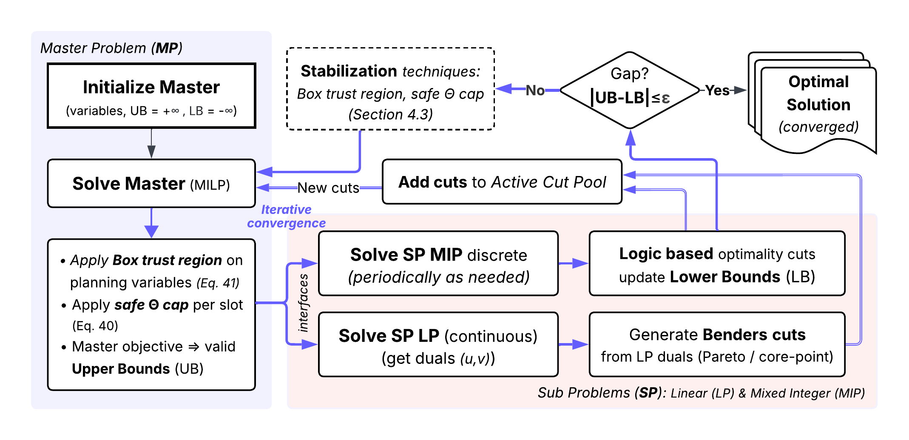

# Large-Scale EV Charging Infrastructure Optimization

## PV and BESS-enabled public EV charging with user redirection

This repository implements a Pyomo/Gurobi optimization framework for planning public electric-vehicle (EV) charging infrastructure with co-located photovoltaic (PV) generation, battery energy storage systems (BESS), and incentive-based short-range user redirection. The model is formulated from the perspective of a charging point operator (CPO) and maximizes annual net profit while satisfying spatiotemporal charging demand.

The repository contains two maintained optimization workflows:

1. a monolithic MILP used for benchmark validation and scenario checks; and
2. a Logic-Based Benders Decomposition (LBBD) implementation for large-scale runs.

Charging demand is generated externally using the MATSim-based simulation framework [`UrbanEV-v2`](https://github.com/parishwadomkar/UrbanEV-v2) and aggregated to spatial planning cells, representative month-days, and half-hour intervals.

<p align="center">
  
</p>

<p align="center"><em>Conceptual scope of the integrated charger–PV–BESS–redirection planning problem.</em></p>

---

## Model scope

The framework jointly represents:

- public charger deployment by charger type
- PV and BESS sizing at candidate spatial cells
- grid procurement, PV self-consumption, BESS charging/discharging, and linked monthly SoC dynamics
- residual home demand served locally by public chargers
- type-aware public charging redirection across eligible short-distance cell pairs
- redirection distance incentives and charger-type tariff-compensation accounting
- annualized charger, PV, and BESS investment costs
- unmet-demand slack variables for diagnostic feasibility.

The model is intended for strategic city-scale planning. It does not model private home-charger investment, upstream grid reinforcement, parcel-level permitting, or real-time heterogeneous user acceptance behavior.

<p align="center">
  
</p>

<p align="center"><em>LBBD workflow used for the city-scale optimization problem.</em></p>

---

## Repository structure and LBBD design

```text
Opti/
├── config/                  # paths, model parameters, and Gurobi settings
├── data/raw/                # small and full input datasets
├── scripts/                 # monolithic run scripts
├── scripts_lbbd/            # LBBD run scripts
├── src/                     # monolithic Pyomo/Gurobi formulation
├── src_lbbd/                # monolithic-comparable LBBD implementation
└── runs/                    # generated run folders and outputs
```

The LBBD master problem retains the investment and temporally coupled energy system decisions:

- charger deployment
- PV deployment
- BESS deployment
- local public/home service
- grid/PV/BESS dispatch
- linked representative-month SoC dynamics
- outgoing redirected energy by origin charger type
- incoming redirected energy by destination charger type
- aggregate physical redirection arc flow
- aggregate trip-bundle and distance-incentive costs.

The type-pair redirection tensor is not placed in the master. Instead, slot-wise type-assignment LP subproblems reconstruct origin/destination charger-type redirection flows conditional on the master solution and return Benders optimality cuts for the residual tariff-compensation recourse term.

This decomposition preserves the monolithic energy-system coupling: incoming redirected demand is included in destination-side service, charger-type capacity, revenue, grid/PV/BESS dispatch, and SoC logic.

### Cut strategies

| Strategy | Description | Recommended use |
|---|---|---|
| `standard` | Standard slot-wise LP-dual Benders cuts. | Validated baseline and recommended first full-data run. |
| `corepoint` | Core-point / Pareto-style auxiliary dual cut selection. | Diagnostic option; may produce stronger cuts but can be slower. |
| `mw` | Compatibility alias for Magnanti-Wong-style cut selection. | Legacy/diagnostic experiments. |
| `pareto` | Compatibility alias for Pareto-style cut selection. | Legacy/diagnostic experiments. |

Use `standard` unless a small-data diagnostic shows that an advanced cut strategy improves runtime and certified bounds for the current dataset and solver settings.

---

## Input data

A typical `config/paths.json` points to files under `data/raw/small/` and `data/raw/full/`:

```text
demandHexGrid_optimization*.gpkg
CharPark*.shp
shortestpath*.csv
spot_prices*.csv
pvgis*.csv
```

The demand file provides aggregated charging demand by cell, month, half-hour interval, and charging context. Parking and land-use files define installation bounds. Shortest-path distances define eligible redirection arcs. Spot-price and PVGIS files provide time-varying electricity and solar-generation inputs.

---

## Installation

Create and activate a Python environment:

```powershell
conda create -n opti python=3.12
conda activate opti
```

Install the Python packages:

```powershell
conda install -c conda-forge geopandas pyogrio shapely pyproj fiona
python -m pip install -r requirements_opti.txt
```

Gurobi must be installed and licensed locally. Verify that Pyomo can access Gurobi before running large cases:

```powershell
python -c "import pyomo.environ as pyo; print(pyo.SolverFactory('gurobi').available())"
```

---

## Optimization runs

Run all commands from the project root.

### Small dataset validation

Full-data-realistic tolerance:

```powershell
python src_lbbd\run_lbbd.py --dataset small --scenario with_redirection --threads 8 --master-gap 0.0005 --subproblem-gap 0.0001 --lbbd-gap 0.0005 --max-iterations 30 --cut-strategy standard
```

Tighter small validation:

```powershell
python src_lbbd\run_lbbd.py --dataset small --scenario with_redirection --threads 8 --master-gap 0.0002 --subproblem-gap 0.0001 --lbbd-gap 0.0002 --max-iterations 40 --cut-strategy standard
```

Small monolithic benchmark:

```powershell
python src\run_optimization.py --dataset small --scenario with_redirection --threads 8 --mip-gap 0.0002
```

The monolithic full-data run can be memory intensive because the type-aware redirection tensor scales with active redirection arc-slots and origin/destination charger-type pairs.

### Full LBBD run

Recommended workstation/HPC run:

```powershell
python src_lbbd\run_lbbd.py --dataset full --scenario with_redirection --threads 16 --master-gap 0.002 --subproblem-gap 0.001 --lbbd-gap 0.001 --max-iterations 25 --time-limit 64800 --cut-strategy standard
```

Memory-guarded smoke-test run:

```powershell
python src_lbbd\run_lbbd.py --dataset full --scenario with_redirection --threads 6 --master-gap 0.005 --subproblem-gap 0.001 --lbbd-gap 0.003 --max-iterations 20 --time-limit 64800 --cut-strategy standard
```

Advanced-cut diagnostic run:

```powershell
python src_lbbd\run_lbbd.py --dataset small --scenario with_redirection --threads 8 --master-gap 0.0002 --subproblem-gap 0.0001 --lbbd-gap 0.0002 --max-iterations 40 --cut-strategy corepoint --core-weight 0.35 --pareto-tolerance 1e-7
```

---

## Scenario and technology switches

| Option | Values / usage | Effect |
|---|---|---|
| `--dataset` | `small`, `full` | Selects input data from `config/paths.json`. |
| `--scenario` | `no_redirection`, `with_redirection` | Enables or disables spatial redirection. |
| `--disable-pv` | flag | Removes PV investment and dispatch. |
| `--disable-bess` | flag | Removes BESS investment, dispatch, and SoC dynamics. |
| `--hard-no-slack` | flag | Enforces zero slack where supported; mainly for validated feasible cases. |

Common scenario modifiers:

| Scenario | Command modifier |
|---|---|
| No PV, no BESS, no redirection | `--scenario no_redirection --disable-pv --disable-bess` |
| No PV, no BESS, with redirection | `--scenario with_redirection --disable-pv --disable-bess` |
| PV only, no redirection | `--scenario no_redirection --disable-bess` |
| PV only, with redirection | `--scenario with_redirection --disable-bess` |
| BESS only, no redirection | `--scenario no_redirection --disable-pv` |
| BESS only, with redirection | `--scenario with_redirection --disable-pv` |
| PV + BESS, no redirection | `--scenario no_redirection` |
| PV + BESS, with redirection | `--scenario with_redirection` |

---

## Solver and LBBD controls

| Option | Values / usage | Effect |
|---|---|---|
| `--threads` | integer | Number of Gurobi threads. Lower values can reduce memory pressure. |
| `--time-limit` | seconds | Solver time limit. |
| `--master-gap` | float | Relative MIP gap for the LBBD master. |
| `--subproblem-gap` | float | Relative tolerance passed to subproblem solves where relevant. |
| `--lbbd-gap` | float | LBBD convergence tolerance computed from the global master upper bound and best certified feasible lower bound. |
| `--max-iterations` | integer | Maximum LBBD iterations. |
| `--cut-strategy` | `standard`, `corepoint`, `mw`, `pareto` | Selects the Benders cut-selection strategy. |
| `--max-cuts-per-iteration` | integer | Limits each iteration to the most violated candidate cuts. |
| `--min-cut-violation` | float | Filters weakly violated cuts. |
| `--core-weight` | float | Moving-average weight for updating the core/reference point. |
| `--core-floor-kwh` | float | Positive floor used in advanced cut-selection reference points. |
| `--pareto-tolerance` | float | Tolerance for the auxiliary Pareto/core-point dual-face restriction. |
| `--write-lp` | flag | Writes LP files for debugging. |

For the monolithic workflow, use `--mip-gap` to control the Gurobi MIP gap.

---

## Outputs

Main output files are written under a timestamped folder in `runs/`. LBBD run folders include `LBBD_Standard` for the validated standard-cut workflow and `LBBD_advCuts_<strategy>` for advanced-cut diagnostics.

| File | Contents |
|---|---|
| `README_RUN.txt` | Terminal transcript and run metadata. |
| `logs/lbbd_manifest.json` | Solver settings, technology switches, dataset, and cut strategy. |
| `logs/gurobi_run.log` | Gurobi log for the current master solve. |
| `results/model_summary.csv` | Economic, energy, infrastructure, and capacity metrics. |
| `results/lbbd_bounds_summary.csv` | certified LBBD upper/lower bounds and gap. |
| `results/quality_checks.csv` | Automated feasibility and residual checks. |
| `results/export_consistency_checks.csv` | Consistency checks between aggregate and type-reconstructed redirection exports. |
| `results/infrastructure_by_hex.csv` | Cell-level charger, PV, BESS, footprint, and capacity outputs. |
| `results/energy_by_charger_type.csv` | Annual served energy and utilization by charger type. |
| `results/redirections.csv` | Aggregate redirected energy by origin, destination, month, and slot. |
| `results/redirections_by_type.csv` | Type-aware origin/destination charger-type redirection flows reconstructed by the subproblem. |
| `results/redirection_slot_balance.csv` | Slot-level aggregate redirection balance diagnostics. |
| `results/origin_type_q.csv` | Origin-type tariff accounting data. |
| `results/destination_type_w.csv` | Incoming destination-type service accounting data. |
| `results/hourly_energy.csv` | Cell-month-slot energy, PV, grid, BESS, and redirection values. |
| `results/slack.csv` | Nonzero slack values, if present. |
| `iterations/lbbd_iteration_history.csv` | LBBD upper/lower bound and cut progress. |
| `iterations/type_assignment_subproblem_summary.csv` | Slot-wise type-assignment LP recourse summaries. |
| `iterations/type_assignment_cuts.csv` | Generated type-assignment Benders cut metadata. |
| `results/aw_vs_monolithic_comparison.csv` or `results/lbbd_vs_monolithic_comparison.csv` | Component-level comparison generated by `compare_runs.py`, depending on the code version used. |

CSV files are the authoritative outputs for large tables. Any convenience workbook should be treated as secondary.
Small nonzero differences between LBBD and monolithic incumbents are expected for large mixed-integer models when both methods stop within their respective optimality gaps.

---

## Reproducibility notes

The full monolithic type-aware redirection model is difficult to solve because redirection variables scale with active arc-slots and origin/destination charger-type pairs. The LBBD implementation reduces memory pressure by keeping aggregate physical redirection and energy-system coupling in the master while reconstructing charger-type-pair redirection through slot-wise LP recourse.

For this maximization model, the reported LBBD gap is computed from the global master upper bound and the best certified feasible lower bound. Small nonzero gaps are expected unless both bounds coincide within the requested tolerance.

For full-data runs on memory-limited machines, reduce `--threads`, use a looser `--master-gap`, and rely on the node-file settings in `config/solver_gurobi.json` where configured. Full-data runs are recommended on a workstation or HPC node when available.

---

## Contact / support

**Omkar Parishwad**  
Urban Mobility Research Group  
Chalmers University of Technology  
Email: [omkarp@chalmers.se](mailto:omkarp@chalmers.se)

For issues, feature requests, or reproducibility questions, please open a GitHub issue in this repository.

---

## Associated articles and data sources

### Charging infrastructure optimization

**Parishwad, Omkar; Najafi, Arsalan; Gao, Kun** — *Joint optimization of charging infrastructure and renewable energies with battery storage considering user redirection incentives.* (preprint)

### Demand simulation source

Charging-demand inputs are based on the MATSim-driven simulation framework [`UrbanEV-v2`](https://github.com/parishwadomkar/UrbanEV-v2).

Published demand-modeling article:

**Parishwad, Omkar; Gao, Kun; Najafi, Arsalan** — *Integrated and agent-based charging demand prediction considering cost aware and adaptive charging behavior*. **Transportation Research Part D: Transport and Environment**, 154 (2026), 105285.  
DOI: <https://doi.org/10.1016/j.trd.2026.105285>
