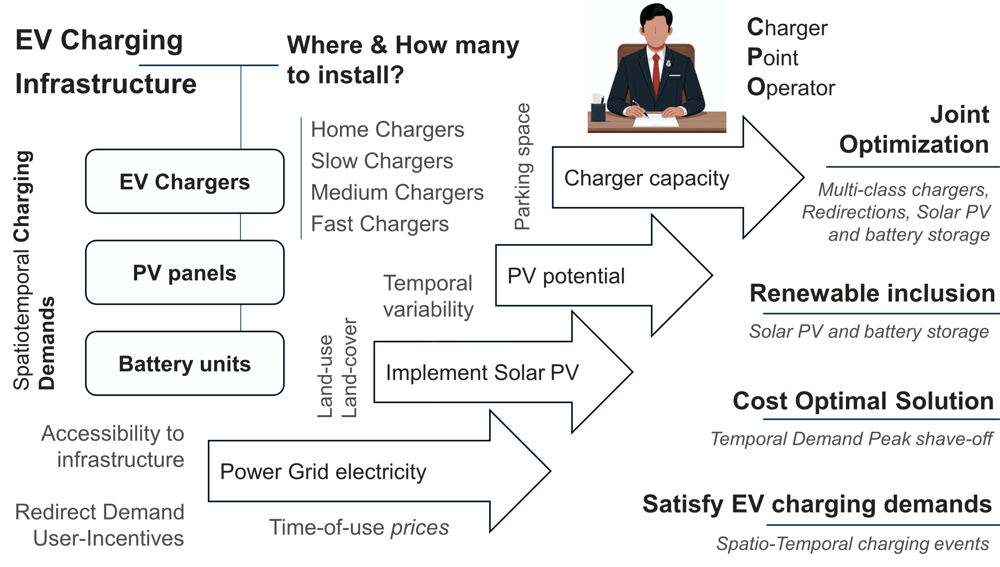
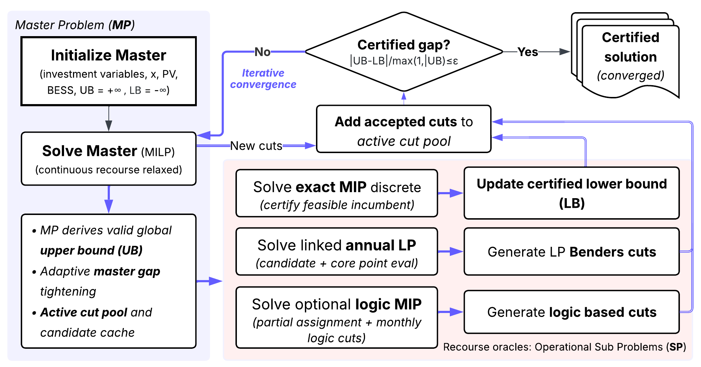

# Large-Scale EV Charging Infrastructure Optimization

## PV- and BESS-enabled public EV charging with user redirection

This repository provides a Pyomo/Gurobi optimization framework for strategic planning of public electric vehicle (EV) charging infrastructure, with on-site photovoltaic (PV) generation, battery energy storage systems (BESS), and short-range user redirection. The optimization is formulated from the perspective of a charging point operator (CPO) and maximizes annual net profit subject to spatiotemporal charging demand, charger-capacity limits, land-use limits, energy-balance constraints, and redirection feasibility.

Charging demand is generated externally using the MATSim-based simulation framework [`UrbanEV-v2`](https://github.com/parishwadomkar/UrbanEV-v2) and aggregated to spatial planning cells, representative month-days, and half-hour time intervals.

<p align="center">
  
</p>

<p align="center"><em>Conceptual scope of the integrated charger–PV–BESS–redirection planning problem.</em></p>

---

## Model scope

The framework represents public charger deployment by charger type, PV and BESS sizing, grid procurement, PV self-consumption, BESS charging/discharging, linked representative-month state-of-charge dynamics, local service of residual home demand, type-aware public-demand redirection, redirection incentives, charger-type tariff compensation, annualized investment costs, and unmet-demand slack diagnostics.

The model is intended for strategic city-scale planning. It does not model private home-charger investment, upstream grid reinforcement, parcel-level permitting, or real-time heterogeneous user-acceptance behavior.

<p align="center">
  
</p>

<p align="center"><em>LBBD workflow used for the city-scale optimization problem.</em></p>

---

## Implemented workflows

| Workflow | Entry point | Intended use |
|---|---|---|
| Monolithic MILP | `src/run_optimization.py` | Benchmark validation and small-instance scenario checks. |
| Benders | `src_benders/run_benders.py` | Arc-witness Benders implementation for comparison and decomposition diagnostics. |
| LBBD | `src_lbbd/run_lbbd.py` | Recommended decomposition workflow for larger redirection-enabled instances. |

Run settings are read from `config/model_config.json`, `config/solver_gurobi.json`, `config/run_profiles.json`, and `config/paths.json`. Command-line options override profile values when supplied. Scenario batch files are available in `scripts/`, `scripts_benders/`, and `scripts_lbbd/`.

---

## Input data

A typical `config/paths.json` points to the small and full datasets under `data/raw/small/` and `data/raw/full/`:

```text
demandHexGrid_optimization*.gpkg
CharPark*.shp
shortestpath*.csv
spot_prices*.csv
pvgis*.csv
```

The demand file provides aggregated charging demand by cell, month, time interval, and charging context. Parking and land-use files define installation bounds. Shortest-path files define eligible redirection arcs. Spot-price and PVGIS files provide electricity-price and solar-generation inputs.

---

## Installation

Install the Python packages:

```powershell
conda install -c conda-forge geopandas pyogrio shapely pyproj fiona
python -m pip install -r requirements_opti.txt
```

Gurobi must be installed and licensed locally. Verify that Pyomo can access Gurobi:

```powershell
python -c "import pyomo.environ as pyo; print(pyo.SolverFactory('gurobi').available())"
```

---

## Optimization runs

Run all commands from the project root.

Small monolithic benchmark:

```powershell
python src\run_optimization.py --dataset small --scenario with_redirection --threads 12 --mip-gap 0.0001
```

Small Benders run:

```powershell
python src_benders\run_benders.py --dataset small --scenario with_redirection --threads 12 --mip-gap 0.0001
```

Small LBBD run:

```powershell
python src_lbbd\run_lbbd.py --dataset small --scenario with_redirection --threads 12 --mip-gap 0.0001
```

Full LBBD run (memory-stable 256 GB workstation/HPC profile):

```powershell
python src_lbbd\run_lbbd.py --dataset full --scenario with_redirection --threads 10 --soft-mem-limit-gb 180 --nodefile-start 0.5 --nodefile-dir "runs\gurobi_nodefiles"
```

Three-way comparison after the runs finish:

```powershell
python src\compare_runs.py --monolithic-run "runs\<MONOLITHIC_RUN_FOLDER>" --benders-run "runs\<BENDERS_RUN_FOLDER>" --lbbd-run "runs\<LBBD_RUN_FOLDER>"
```

Common scenario and technology switches:

| Option | Values / usage | Effect |
|---|---|---|
| `--dataset` | `small`, `full` | Selects the input dataset from `config/paths.json`. |
| `--scenario` | `no_redirection`, `with_redirection` | Enables or disables spatial user redirection. |
| `--disable-pv` | flag | Removes PV investment and dispatch. |
| `--disable-bess` | flag | Removes BESS investment, dispatch, and SoC dynamics. |
| `--threads` | integer | Sets the Gurobi thread count. Conservative values are recommended for memory-intensive full-data runs. |
| `--mip-gap` | float | Convenience override for the exact annual MIP gap and certified LBBD gap. For full LBBD runs, the separate controls below are preferred. |
| `--master-gap` | float | Trial-master MIP gap used by LBBD. |
| `--master-gap-tight` | float | Tighter trial-master gap used automatically near convergence or after repeated candidates. |
| `--lbbd-gap` | float | Final certified outer LBBD gap target. For example, `0.02` means 2%. |
| `--subproblem-gap` | float | Exact annual operational-recourse MIP gap. |
| `--logic-mip-gap` | float | Gap used for exact monthly logic-MIP inference. |
| `--first-master-solution-limit` | integer | Optional iteration-1 feasibility bootstrap; `1` stops the first master after its first feasible integer solution and enables Gurobi's additional feasible-point search behavior. |
| `--master-heuristic-time` | seconds | Time allocated to the iteration-1 Gurobi NoRel feasibility heuristic. |
| `--soft-mem-limit-gb` | GB | Gurobi soft memory limit; the solver terminates gracefully rather than forcing a hard out-of-memory crash when possible. |
| `--nodefile-start` | GB | Threshold for writing branch-and-bound node data to disk. |
| `--nodefile-dir` | path | Directory used for Gurobi node files; a fast local SSD is recommended. |
| `--time-limit` | seconds | Sets the overall run time limit. |
| `--skip-figures` | flag | Disables automatic figure generation. |

Common scenario modifiers:

| Scenario | Command modifier |
|---|---|
| No PV, no BESS, no redirection | `--scenario no_redirection --disable-pv --disable-bess` |
| No PV, no BESS, with redirection | `--scenario with_redirection --disable-pv --disable-bess` |
| PV only, no redirection | `--scenario no_redirection --disable-bess` |
| PV only, with redirection | `--scenario with_redirection --disable-bess` |
| BESS only, no redirection | `--scenario no_redirection --disable-pv` |
| BESS only, with redirection | `--scenario with_redirection --disable-pv` |
| PV + BESS, no redirection | `--scenario no_redirection` |
| PV + BESS, with redirection | `--scenario with_redirection` |

---

## Outputs

Each run writes a timestamped folder under `runs/`. The main outputs are stored in `results/`, solver logs in `logs/`, and figures in `figures/`.

| File | Contents |
|---|---|
| `README_RUN.txt` | Terminal transcript and run metadata. |
| `results/model_summary.csv` | Economic, infrastructure, energy, redirection, and capacity metrics. |
| `results/run_summary.csv` | Run-level objective, status, technology switches, and solver-gap information. |
| `results/quality_checks.csv` | Automated feasibility and consistency checks. |
| `results/infrastructure_by_hex.csv` | Cell-level charger, PV, BESS, footprint, and capacity outputs. |
| `results/energy_by_charger_type.csv` | Annual energy and utilization by charger type. |
| `results/hourly_energy.csv` | Cell-month-slot grid, PV, BESS, service, and redirection values. |
| `results/redirections.csv` | Redirected energy by origin, destination, month, and time interval. |
| `results/redirections_by_type.csv` | Type-aware origin/destination charger-type redirection flows. |
| `results/slack.csv` | Nonzero unmet-demand slack values, if present. |
| `results/combined_results.xlsx` | Convenience workbook with exported tables. |
| `results/computational_complexity_table.csv` | Model-size, timing, redirection-complexity, and solver-complexity metrics. |
| `results/slot_redirection_complexity.csv` | Slot-level redirection set sizes and type-expanded complexity. |
| `figures/figures_manifest.csv` | List of generated and skipped figures. |

LBBD runs additionally export `results/lbbd_history.csv`, bound summaries, cut diagnostics, candidate-cache diagnostics, and decomposition figures. Benders runs export corresponding iteration and cut-history files. The comparison command writes a formatted Excel workbook under `runs/comparisons/` with economic, infrastructure, energy, redirection, and computational-efficiency comparisons across the three workflows.

Figures are generated automatically after a successful run. They can also be regenerated for an existing run.
---

## Reproducibility notes

The small dataset is intended for validation, debugging, and comparison across workflows. The full dataset is intended for city-scale analysis and may require a high-memory workstation or HPC node, particularly for the monolithic formulation.

For this maximization model, decomposition gaps are reported using the global upper bound from the relaxed master and the best certified feasible incumbent. Small objective differences across workflows are expected when runs terminate within their requested solver tolerances.

Large full-data runs should be executed with conservative thread counts, a `SoftMemLimit`, disk-backed node files on a fast local drive, and explicit time limits. The calibrated full LBBD profile uses dual simplex for the large root and node LP relaxations to avoid the higher memory footprint of barrier/concurrent root algorithms. `NodefileStart` controls branch-and-bound tree storage after branching begins; it does not replace the RAM required to build, presolve, and solve the root relaxation.

For LBBD, prefer the dedicated `--master-gap`, `--lbbd-gap`, and `--subproblem-gap` controls when overriding the full-data profile. A single loose `--mip-gap` also loosens the exact annual recourse tolerance. The active configuration for each run is stored with the run outputs.

---

## Contact / support

**Omkar Parishwad**  
Urban Mobility Research Group  
Chalmers University of Technology  
Email: [omkarp@chalmers.se](mailto:omkarp@chalmers.se)

For issues, feature requests, or reproducibility questions, please open a GitHub issue in this repository.


---

## Associated articles and data sources

### Charging infrastructure optimization

**Parishwad, Omkar; Najafi, Arsalan; Gao, Kun** — *Joint Optimization of Charging Infrastructure and Renewable Energies with Battery Storage Considering User Redirection Incentives.*

### Demand simulation source

Charging-demand inputs are based on the MATSim-driven simulation framework [`UrbanEV-v2`](https://github.com/parishwadomkar/UrbanEV-v2).

Published demand-modeling article:

**Parishwad, Omkar; Gao, Kun; Najafi, Arsalan** — *Integrated and Agent-Based Charging Demand Prediction Considering Cost-Aware and Adaptive Charging Behavior*. **Transportation Research Part D: Transport and Environment**, 154 (2026), 105285.  
DOI: <https://doi.org/10.1016/j.trd.2026.105285>
