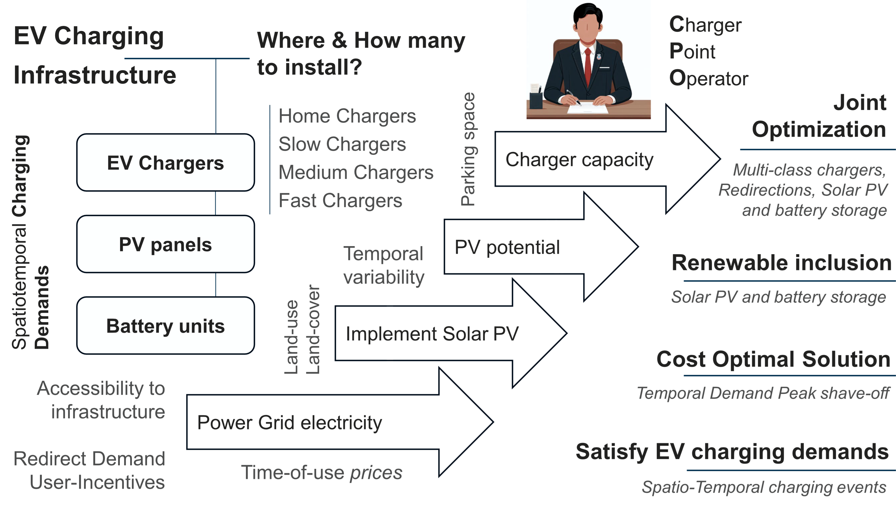
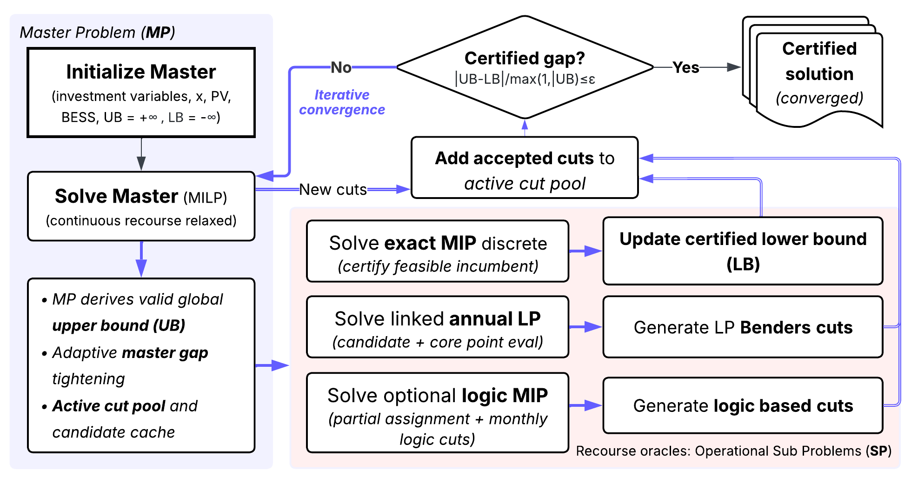

# Large-Scale EV Charging Infrastructure Optimization

## PV- and BESS-enabled public EV charging with user redirection

This repository provides an optimization framework for strategic planning of public electric vehicle (EV) charging infrastructure, with on-site photovoltaic (PV) generation, battery energy storage systems (BESS), and short range user redirection. The optimization is formulated (Pyomo/Gurobi) from the perspective of a charging point operator (CPO) and maximizes annual net profit subject to spatiotemporal charging demand, charger capacity limits, landuse limits, energy balance constraints, and redirection feasibility.

Charging demand is generated externally using the MATSim-based simulation framework [`UrbanEV-v2`](https://github.com/parishwadomkar/UrbanEV-v2) and aggregated to spatial planning cells, representative month-days, and half-hour time intervals.

<p align="center">
  
</p>

<p align="center"><em>Conceptual scope of the integrated charger–PV–BESS–redirection planning problem.</em></p>

---

## Model scope

The framework represents public charger deployment by charger type, PV and BESS sizing, grid procurement, PV self-consumption, BESS charging/discharging, annually linked representative-month state-of-charge (SoC) dynamics, local service of residual home demand, type-aware public demand redirection, redirection incentives, charger-type tariff compensation, annualized investment costs, and penalized unmet demand slack.

The model is intended for strategic city scale planning. It does not model private home charger investment, upstream grid reinforcement, parcel level permitting, or real time heterogeneous user acceptance behavior.

<p align="center">
  
</p>

<p align="center"><em>LBBD workflow used for the city-scale optimization problem.</em></p>

---

## Implemented workflows

| Workflow | Entry point | Intended use |
|---|---|---|
| Monolithic MILP | `src/run_optimization.py` | Reference formulation; small and full benchmark runs. |
| Benders | `src_benders/run_benders.py` | Arc-witness decomposition and comparison runs. |
| LBBD | `src_lbbd/run_lbbd.py` | Decomposition with exact annual recourse certification. |

Run settings are read from `config/model_config.json`, `config/solver_gurobi.json`, `config/run_profiles.json`, and `config/paths.json`; supplied command-line options override profile values.
The method-specific scripts remain in `scripts/`, `scripts_benders/`, and `scripts_lbbd/`.

---

## Input data

The configured inputs are in [`data/`](data/). `config/paths.json` selects `data/small/` or `data/full/` and references:

```text
data/{small,full}/demandHexGrid*.gpkg
data/{small,full}/CharPark*.shp
data/{small,full}/shortestpath.csv
data/ElPrice.csv
data/PVGISdata.xlsx
```

The demand files aggregate charging events by cell, month, half-hour slot, and charging context. Parking and land-use files define installation bounds, and the shortest-path files define eligible redirection arcs. The price and PVGIS files provide electricity and solar inputs. Several geospatial files and the PVGIS workbook use Git LFS; retrieve their actual contents before running.

---

## Installation

Install Git LFS, retrieve the data, and install the Python packages:

```powershell
git lfs install
git lfs pull
conda install -c conda-forge geopandas pyogrio shapely pyproj fiona
python -m pip install -r requirements_opti.txt
```

Gurobi must be installed and licensed locally. Verify that Pyomo can access Gurobi:

```powershell
python -c "import pyomo.environ as pyo; print(pyo.SolverFactory('gurobi').available())"
```

---

## Optimization runs

Run all commands from the project root.

Small monolithic benchmark:

```powershell
python src\run_optimization.py --dataset small --scenario with_redirection --threads 10 --mip-gap 0.0001
```

Small Benders run:

```powershell
python src_benders\run_benders.py --dataset small --scenario with_redirection --threads 10 --master-gap 0.0001 --benders-gap 0.0001
```
The implemented Benders decomposition workflow is explained in [`src_benders/README.md`](https://github.com/parishwadomkar/Large-scale-LBBD-Optimization/blob/main/src_benders/README.md).

Small LBBD run:

```powershell
python src_lbbd\run_lbbd.py --dataset small --scenario with_redirection --threads 10 --master-gap 0.0001 --subproblem-gap 0.00001 --lbbd-gap 0.0001
```

Full cold-start LBBD example (the detailed command and settings are in [`runs/terminalRuns.txt`](runs/terminalRuns.txt)):

```powershell
python src_lbbd\run_lbbd.py --dataset full --scenario with_redirection --threads 10 --subproblem-threads 2 --lbbd-gap 0.0002 --subproblem-gap 0.00001 --max-iterations 16 --time-limit 1728000 --soft-mem-limit-gb 180 --nodefile-start 0.5 --nodefile-dir "runs\gurobi_nodefiles" --bound-polish
```
Selected small and full results are available under [`runs/`](runs/). Full models can take days and may stop at a resource limit with a valid incumbent and bound. A command specifies a target, not a guaranteed certificate.


Three-way comparison after the runs finish:

```powershell
python src\compare_runs.py --monolithic-run "runs\<MONOLITHIC_RUN_FOLDER>" --benders-run "runs\<BENDERS_RUN_FOLDER>" --lbbd-run "runs\<LBBD_RUN_FOLDER>"
```
Compare only matching dataset, scenario, technology, and resource settings; the [small comparison workbook](runs/comparisons/Small_monolithic_benders_lbbd_comparison.xlsx) is an example of a run comparison.

Same-method comparison across different scenarios:

```powershell
python src\compare_scenarios.py --method lbbd --run "runs\<SCENARIO_RUN_1>" --run "runs\<SCENARIO_RUN_2>" --run "runs\<SCENARIO_RUN_3>"
```

`--method` accepts `monolithic`, `benders`, or `lbbd`. The first supplied run is used as the baseline by default. Custom labels and a different baseline can be supplied when needed.

```powershell
python src\compare_scenarios.py `
  --method lbbd `
  --run "runs\<SCENARIO_RUN_1>" `
  --run "runs\<SCENARIO_RUN_2>" `
  --label "PV + BESS, no redirection" `
  --label "PV + BESS, with redirection" `
  --baseline-index 1
```

The same method comparison writes a formatted workbook under `runs/comparisons/` containing scenario summaries, changes relative to the baseline, redirection effects, scenario ranking, computational summaries, run metadata, raw metrics, and consistency checks. It is independent of `compare_runs.py`, which remains the comparator for monolithic–Benders–LBBD runs.


Common scenario and technology switches:

| Option | Values / usage | Effect |
|---|---|---|
| `--dataset` | `small`, `full` | Selects the input dataset from `config/paths.json`. |
| `--scenario` | `no_redirection`, `with_redirection` | Enables or disables spatial user redirection. |
| `--disable-pv` | flag | Removes PV investment and dispatch. |
| `--disable-bess` | flag | Removes BESS investment, dispatch, and SoC dynamics. |
| `--threads` | integer | Sets Gurobi threads; full-data memory use depends on the method and machine. |
| `--mip-gap` | float | Monolithic MIP target; convenience override for Benders and LBBD targets. Use method-specific controls for full decomposition runs. |
| `--master-gap`, `--master-gap-tight` | float | LBBD trial-master MIP tolerances; distinct from its final certificate. |
| `--lbbd-gap` | float | LBBD global-bound target; `0.0002` means 0.020%. |
| `--subproblem-gap` | float | LBBD exact annual recourse MIP tolerance. |
| `--first-master-lp-bootstrap` | flag | Builds an internal investment candidate from the first master LP; exact MIP certification is still required. |
| `--bound-polish` | flag | Switches later LBBD master solves toward bound improvement at the configured trigger. |
| `--soft-mem-limit-gb` | GB | Gurobi soft memory limit; leave RAM for Python and the operating system. |
| `--nodefile-start` | GB | Threshold for writing branch-and-bound node data to disk. |
| `--nodefile-dir` | path | Directory used for Gurobi node files; a fast local SSD is recommended. |
| `--time-limit` | seconds | Monolithic solve limit or LBBD overall limit; Benders also accepts `--overall-time-limit`. |
| `--skip-figures` | flag | Disables automatic figure generation. |

Available scenario modifiers:

| Scenario | Command modifier |
|---|---|
| No PV, no BESS, no redirection | `--scenario no_redirection --disable-pv --disable-bess` |
| No PV, no BESS, with redirection | `--scenario with_redirection --disable-pv --disable-bess` |
| PV only, no redirection | `--scenario no_redirection --disable-bess` |
| PV only, with redirection | `--scenario with_redirection --disable-bess` |
| BESS only, no redirection | `--scenario no_redirection --disable-pv` |
| BESS only, with redirection | `--scenario with_redirection --disable-pv` |
| PV + BESS, no redirection | `--scenario no_redirection` |
| PV + BESS, with redirection | `--scenario with_redirection` |

---

## Outputs

Each run writes a timestamped folder under `runs/`. The main outputs are stored in `results/`, solver logs in `logs/`, and figures in `figures/`.

| File | Contents |
|---|---|
| `README_RUN.txt` | Terminal transcript for that run. |
| `results/model_summary.csv` | Economic, infrastructure, energy, redirection, and capacity metrics for an exported incumbent. |
| `run_metadata.json` / `results/solver_certificate.json` | Method-specific termination and bound records, when emitted. |
| `results/infrastructure_by_hex.csv` | Cell-level charger, PV, BESS, charger-resource use, and capacity outputs. |
| `results/energy_by_charger_type.csv` | Annual energy and utilization by charger type. |
| `results/hourly_energy.csv` | Cell-month-slot grid, PV, BESS, service, and redirection values when exported. |
| `results/redirections.csv` | Redirected energy by origin, destination, month, and time interval. |
| `results/redirections_by_type.csv` | Type-aware origin/destination charger-type redirection flows. |
| `results/slack.csv` | Nonzero unmet-demand slack values, if present. |
| `results/combined_results.xlsx` | Convenience workbook; oversized tables remain CSV-only. |
| `results/computational_complexity_table.csv` | Model-size, timing, redirection-complexity, and solver-complexity metrics. |
| `results/slot_redirection_complexity.csv` | Slot-level redirection set sizes and type-expanded complexity. |
| `figures/figures_manifest.csv` | List of generated and skipped figures. |

LBBD additionally writes `results/lbbd_history.csv`, bound/cut diagnostics, and decomposition figures. Benders writes iteration and cut histories under `iterations/`. A monolithic solve records `results/solver_certificate.json` even when no feasible incumbent is loaded. Comparison workbooks go to `runs/comparisons/`.


---

## Reproducibility notes

The small dataset is intended for validation, debugging, and comparison across workflows. The full dataset is intended for city-scale analysis and may require a high memory workstation or HPC node, particularly for the monolithic formulation.

For this maximization model, the LBBD certificate uses its valid global master upper bound (UB) and best exact-certified feasible lower bound (LB): `(UB - LB) / max(1, abs(UB))`. Monolithic MIP and Benders gaps use the incumbent denominator, `max(1, abs(LB))`. A fixed-layout recourse bound is not a global UB. Inspect termination, slack, bounds, and the achieved gap before using a result.

Large full-data runs need enough RAM, explicit time and Gurobi soft-memory limits, and a fast local node-file directory. The full LBBD profile requests dual simplex for its large root and node LP relaxations. `NodefileStart` affects branch-and-bound tree storage after branching begins..It cannot reduce memory needed to build or solve the root relaxation.

For full LBBD runs, use dedicated `--master-gap`, `--lbbd-gap`, and `--subproblem-gap` controls: a loose `--mip-gap` also loosens annual recourse certification. Cold runs must omit external restart/investment options. Record the code commit, input/configuration versions, solver version, and effective settings in each run folder; [`runs/terminalRuns.txt`](runs/terminalRuns.txt) provides the command matrix.

---

## Contact / support

**Omkar Parishwad**  
Urban Mobility Research Group  
Chalmers University of Technology  
Email: [omkarp@chalmers.se](mailto:omkarp@chalmers.se)

For issues, feature requests, or reproducibility questions, please open a GitHub issue in this repository.


---

## Associated articles and data sources

### Charging infrastructure optimization

**Parishwad, Omkar; Najafi, Arsalan; Yang, Ying; Gao, Kun** — *User redirection-aware co-optimization of public charging with local photovoltaics and battery storage.*

### Demand simulation source

Charging-demand inputs are based on the MATSim-driven simulation framework [`UrbanEV-v2`](https://github.com/parishwadomkar/UrbanEV-v2).


Published demand-modeling article:

**Parishwad, Omkar; Gao, Kun; Najafi, Arsalan** — *Integrated and Agent-Based Charging Demand Prediction Considering Cost-Aware and Adaptive Charging Behavior*. **Transportation Research Part D: Transport and Environment**, 154 (2026), 105285.  
DOI: <https://doi.org/10.1016/j.trd.2026.105285>
