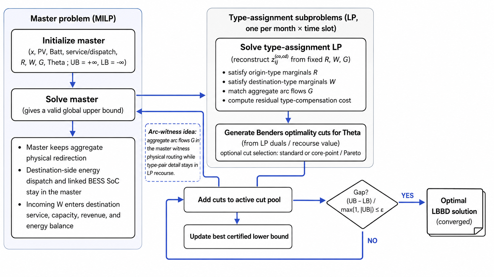

# Benders Decomposition

This folder contains the Benders decomposition implementation for the public EV charging infrastructure optimization model. It uses the same input data, model configuration, solver configuration, and output conventions as the monolithic and LBBD workflows in the main repository.

The implementation is intended as a decomposition benchmark between the full monolithic MILP and the compact LBBD workflow. It is useful for validating type-aware redirection logic, Benders cut generation, and decomposition diagnostics on the small dataset, while also documenting why a more compact LBBD formulation is needed for larger instances.

  

## Method summary

The Benders workflow keeps the main investment and operational planning structure in a master MILP and evaluates the type-assignment part of redirection through slot-wise LP subproblems. At each iteration, the master proposes charger, PV, BESS, service, dispatch, aggregate redirection, and BESS-SoC decisions. The LP subproblems reconstruct type-pair redirection detail from the fixed aggregate master values and return violated Benders cuts when the master underestimates the recourse value.

Supported cut strategies include:

| Strategy | Use |
|---|---|
| `standard` | Baseline LP-dual Benders cuts. |
| `corepoint` | Recommended cut selection for validation and larger runs. |
| `mw`, `pareto` | Compatibility aliases for core-point style cut selection. |

## Outputs

Each run writes a timestamped folder under `runs/`. The main outputs are:

| Output | Purpose |
|---|---|
| `results/model_summary.csv` | Objective, infrastructure, energy, redirection, and cost summaries. |
| `results/combined_results.xlsx` | Workbook combining the exported result tables. |
| `iterations/benders_iteration_history.csv` | Per iteration bounds, gap, cut generation, and timing diagnostics. |
| `figures/` | Infrastructure, energy, redirection, and decomposition convergence figures. |
| `logs/` | Solver logs and run metadata. |

The comparison workbook generated by `src\compare_runs.py` includes objective/economic metrics, infrastructure counts, redirection metrics, solver complexity tables, and method efficiency summaries.

## Recommended use

Use this implementation when:

- validating the redirection type-assignment recourse against the monolithic formulation;
- checking whether generated Benders cuts reproduce the expected small-instance objective and infrastructure decisions;
- producing decomposition diagnostics for comparison with the monolithic and LBBD methods;
- documenting the computational effect of removing explicit type-pair redirection variables from the main optimization block.

## Limitations

This Benders implementation reduces part of the explicit redirection tensor, but it does not sufficiently resolve the main memory bottleneck of the full-scale model. The master problem still retains a large amount of cell-month-slot operational structure, including aggregate redirection, destination-side dispatch, linked BESS SoC, trip-bundle logic, and many service/energy variables.

As a result, the improvement over the monolithic model is limited for large-scale runs: the simultaneously solved master remains large, repeated master solves can become expensive, and the method may still require substantial memory and solver time. The Benders version is therefore best treated as an intermediate benchmark rather than the final scalable implementation.

The LBBD workflow in `src_lbbd/` addresses this limitation more directly by using a more compact master, embedded relaxations, LP-based bound strengthening, and exact linked annual MIP certification. For full-data experiments, use the LBBD workflow as the primary decomposed optimization method and use this Benders implementation mainly for validation and comparison.
